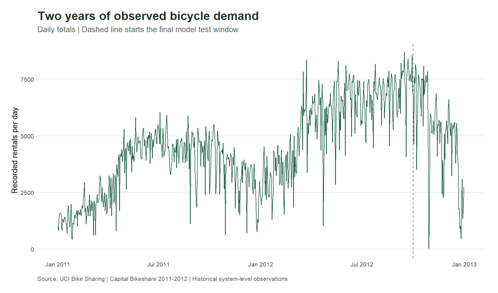
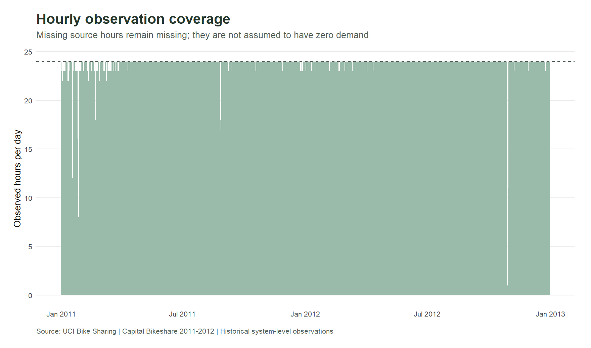
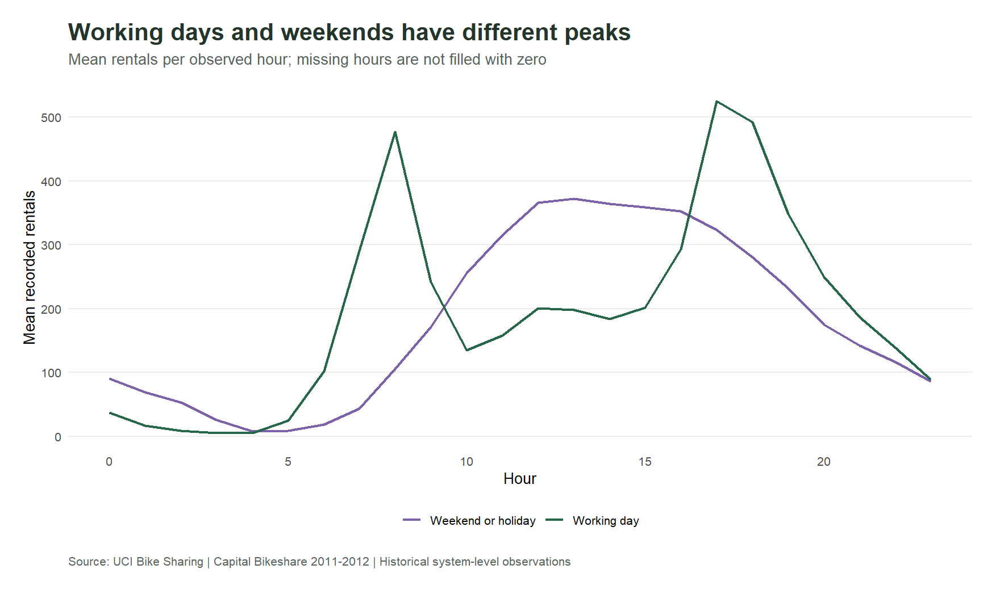
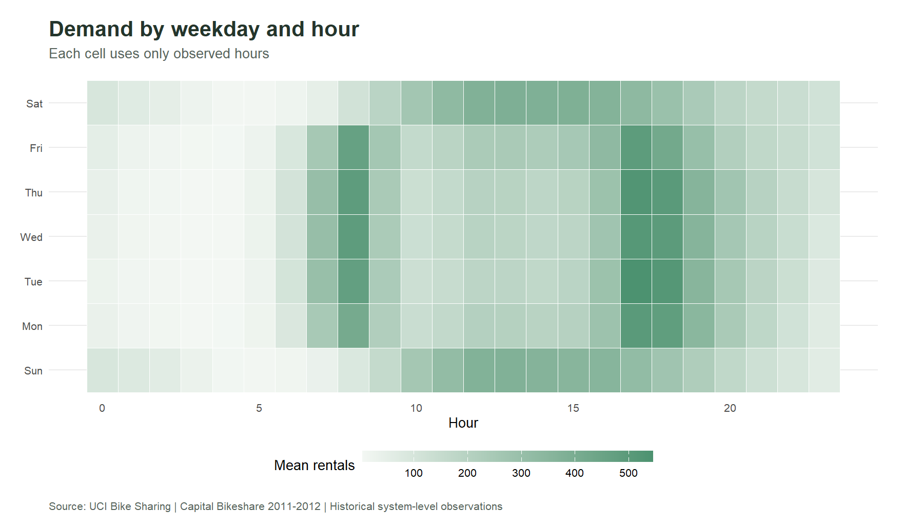
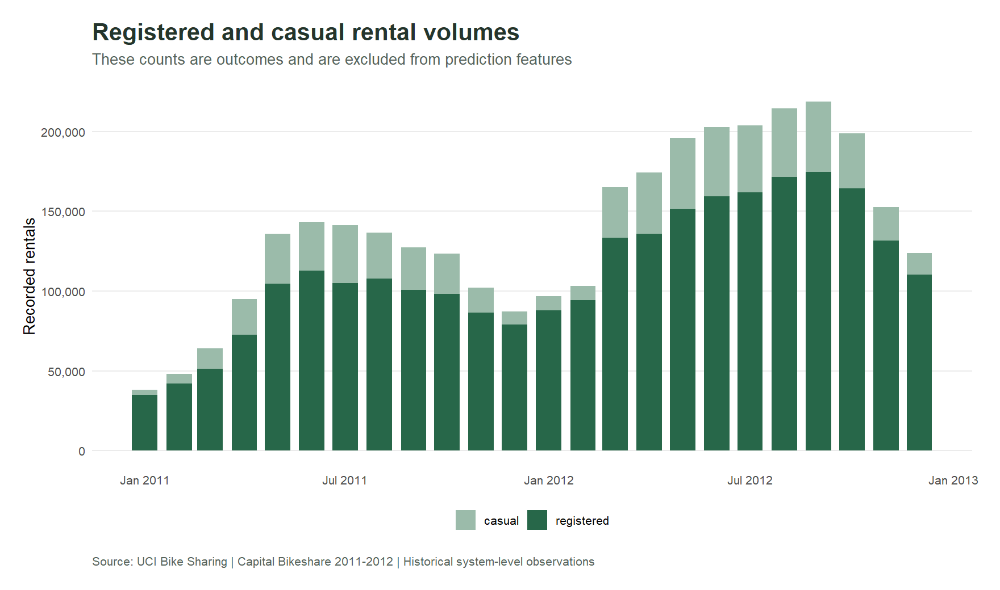
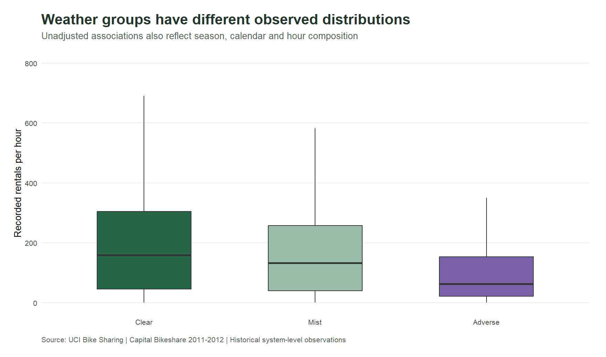
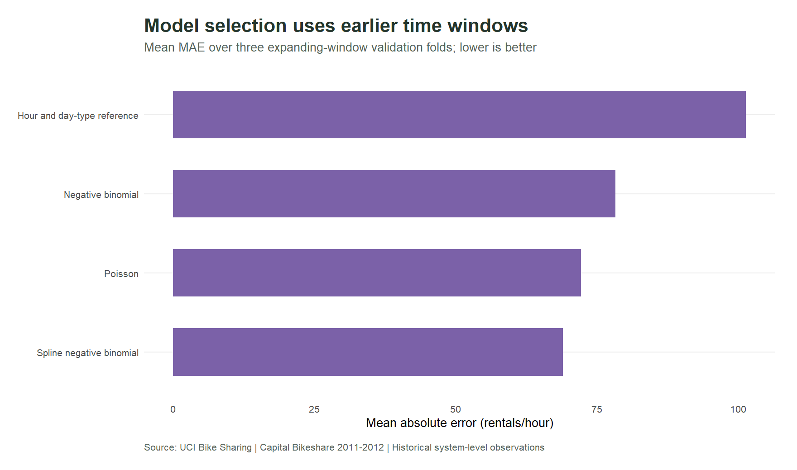
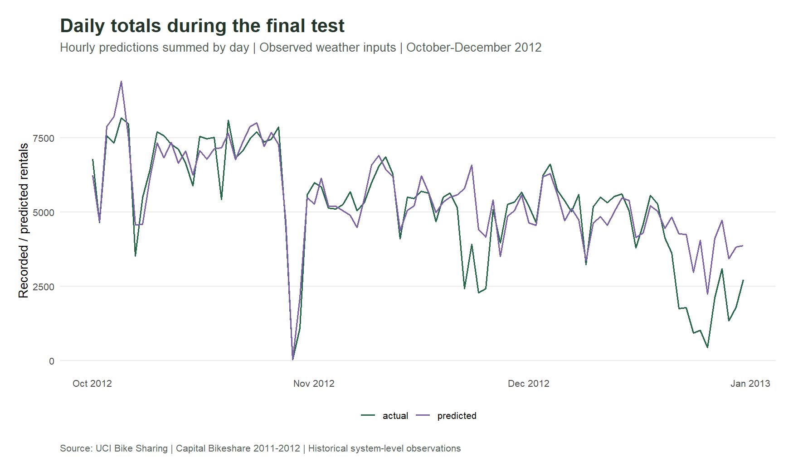
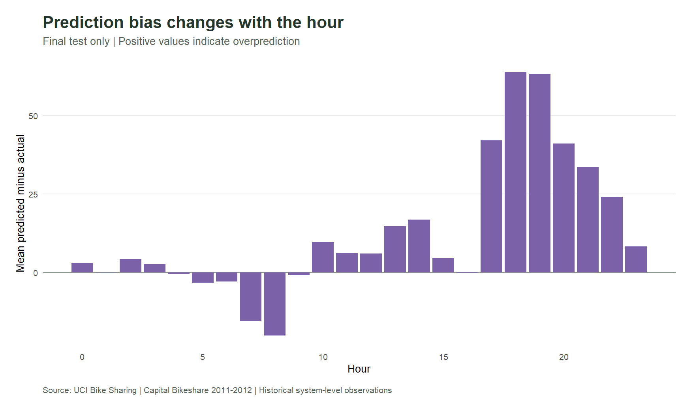
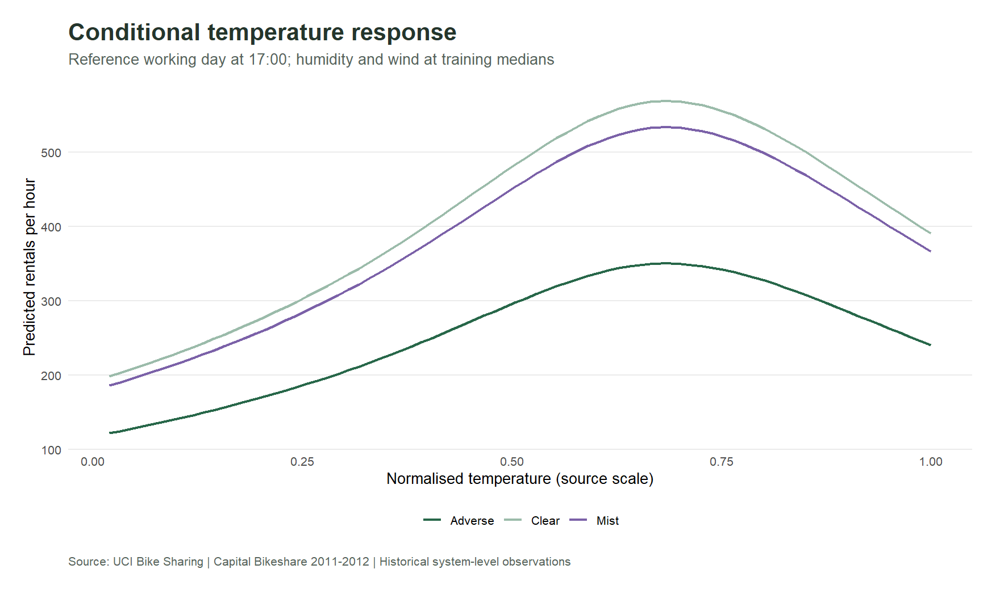

```{r}
x <- readRDS("../data/processed/results.rds")
m <- x$metrics
count <- function(v) format(v, big.mark = ",", scientific = FALSE, trim = TRUE)
pct <- function(v) paste0(round(v * 100, 1), "%")
table_view <- function(d) {
  d[] <- lapply(d, function(v) if (is.numeric(v)) format(round(v, 3), big.mark = ",", scientific = FALSE, trim = TRUE) else v)
  knitr::kable(d)
}
```

Urban Demand examines when recorded bicycle rentals peak, how patterns differ across the calendar and how an interpretable model performs on later observations. The source contains **`r count(m$hourly_rows)` hourly records**, **`r count(m$daily_rows)` daily records** and **`r count(m$total_rentals)` recorded rentals** in 2011-2012.

The selected **`r m$selected_model`** achieves a final-test MAE of **`r round(m$test_mae, 2)` rentals per hour**, compared with **`r round(m$baseline_mae, 2)`** for a training hour/day-type mean reference. That is a **`r pct(m$mae_improvement_vs_reference)` reduction in MAE** in this historical evaluation. The model uses observed weather and has not been validated as an advance forecast with forecast weather.



## Data coverage and what the counts mean

Hourly counts sum exactly to the published daily totals. The hourly file contains **`r count(m$missing_source_hours)` absent calendar-hour records** across **`r count(m$incomplete_days)` days**. Their cause is not documented. Missing hours remain missing rather than being imputed as zero demand.



The pipeline validates unique day/hour keys, missingness, count decomposition, covariate bounds and hourly/daily reconciliation. The original archive README confirms 17,379 hourly records; the UCI landing page's instance summary differs. Analysis counts follow the actual verified file.

Recorded rentals are completed recorded demand, potentially affected by availability. There are no station stock-outs, denied requests, route flows, capacities or rebalancing costs. These system-wide data cannot prescribe stock at individual stations.

## Hour and weekday patterns



Working-day profiles and weekend/holiday profiles are kept separate. Each mean divides rentals by its count of observed hourly records. Combining all days into one hourly average would hide useful differences in timing.



The heatmap describes recorded system activity. It can support an operational staffing hypothesis, but staffing capacity and service time are not in the dataset. A pilot should combine the profile with those measurements before changing resources.

## Rider mix and weather associations



Registered rentals account for **`r pct(m$registered_rental_share)`** of the observed total. Registered and casual counts are components of the target. They appear in historical descriptions and are excluded from all prediction features.



Weather group comparisons are observational. Season, hour and working-day composition also differ between groups. Codes 3 and 4 are pooled as Adverse for modelling because severe weather is sparse. Normalised weather scales follow the original hourly source; hourly and daily transformations are not mixed.

## Model selection before the final test

Three expanding training windows are evaluated on January-March, April-June and July-September 2012. October-December 2012 is reserved for final testing. Within every fold, training dates strictly precede validation dates.

The candidates are an hour/day-type training mean, Poisson regression, negative-binomial regression and spline negative-binomial regression. Regression predictors include hour-by-day-type interaction, weekday, grouped weather, temperature, humidity, wind, elapsed-time trend and calendar harmonics. The spline candidate uses natural splines for temperature and humidity fitted on training data.



```{r}
table_view(x$validation$scores[, c("model", "fold", "train_end", "validation_start", "validation_end", "mae", "rmse", "wape")])
```

Model selection minimises the mean MAE across the three validation windows. The test results do not select the model or tune its features. The final selected model is fitted on all dates before 1 October 2012.

## Final out of time evaluation

The final test contains **`r count(m$test_rows)` observed hours**, from **`r m$test_start`** through **`r m$test_end`**. MAE and RMSE use rentals per hour. WAPE is total absolute error divided by actual rental total, rather than an average of unstable hourly percentage errors.

```{r}
table_view(x$test_scores[, c("model", "rows", "mae", "rmse", "wape", "mean_bias")])
```



The selected model's final-test WAPE is **`r pct(m$test_wape)`**. Daily predictions here sum the evaluated hourly predictions. This figure does not present a separate daily forecast model, and the evaluation conditions include observed contemporaneous weather.

### Paired uncertainty in the error difference

A paired bootstrap resamples contiguous seven-day blocks from the test-window errors 1,000 times. The observed MAE difference is **`r round(x$bootstrap$observed_difference, 2)` rentals per hour**, with a block-bootstrap 95% range of **`r round(x$bootstrap$lower95, 2)` to `r round(x$bootstrap$upper95, 2)`**. This uncertainty describes the historical evaluation under the chosen block-length assumption; it does not guarantee improvement in future cities or years.

### Errors vary across hours and weather



```{r}
table_view(x$error_by_weather)
```

These views locate uneven performance that the aggregate MAE can conceal. Positive bias means overprediction; negative bias means underprediction. Operational decisions should consider both the error size and the cost of each direction.

## Intervals and calibration

```{r}
table_view(x$intervals)
```

The conditional count-distribution intervals have a nominal 95% level, but actual final-test coverage is **`r pct(x$intervals$observed_test_coverage)`**. That shortfall matters: the intervals should not be presented as calibrated operational guarantees. They exclude parameter uncertainty and errors in weather forecasts. Further calibration must use a new validation design before a new untouched test.

## Interpreting the fitted response



The reference calendar date is **`r as.character(x$response_reference_date)`** at 17:00 on a working day. Humidity and wind are fixed at training medians. This controlled input grid helps explain the fitted function; it does not establish a causal effect of changing weather or represent a station-level forecast.

## Operational recommendations

**Separate planning by day type and hour.** Use historical profiles as a first workload estimate, then combine them with service time, station capacity and availability. Evaluate a scheduling pilot against service targets.

**Build an availability-aware forecasting evaluation.** Replace observed weather with forecasts available at the chosen planning horizon, document feature timestamps and retest on later periods. Compare against seasonal references under the same available information.

**Calibrate intervals before using them for buffers.** The observed coverage shortfall means a nominal 95% interval is not enough to select an operational safety margin. Include the cost of underprediction and overprediction in the decision.

**Collect station movements before recommending rebalancing.** Add station pickups/drop-offs, inventory positions, stock-out durations, route costs and capacity constraints. The present system totals support demand analysis but cannot optimise routes or guarantee availability.

## Reproduce the study

Open `UrbanDemand.Rproj`, run `scripts/setup.R`, `scripts/check_rules.R` and `scripts/run_analysis.R`, then render this report. Original data is protected by its manifest; the R library is recorded in `renv.lock`. Each fold, final prediction, metric and quality table is exported for inspection. Source and transformation details are documented in the methodology.

## Source

Fanaee-T, H. (2013). *Bike Sharing*. UCI Machine Learning Repository. [DOI 10.24432/C5W894](https://doi.org/10.24432/C5W894). Licensed under [CC BY 4.0](https://creativecommons.org/licenses/by/4.0/). This project transforms the published files through validation, aggregation and statistical modelling.
